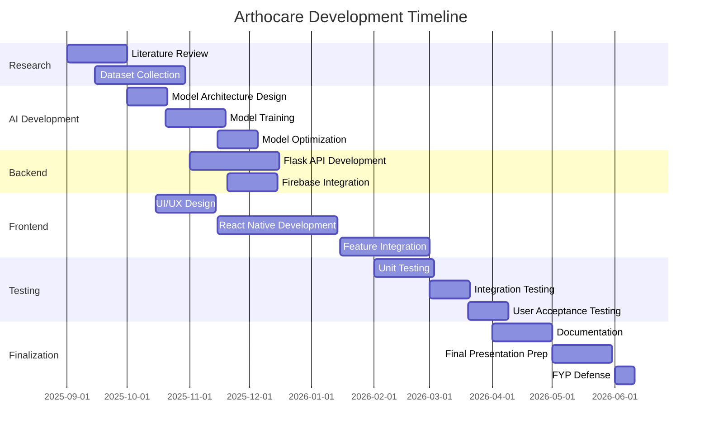

---

## 👥 Team

Meet the amazing team behind Arthocare:

<table>
  <tr>
    <td align="center">
      <a href="https://github.com/HEERHARISH1">
        
         
        <b>Heer Lohana</b>
      </a>
       
      <a href="https://linkedin.com/in/heerharish">LinkedIn</a> • 
      <a href="mailto:heer.harish04@gmail.com">Email</a>
       
      AI/ML Engineer • Backend Developer
       
      📞 +92 303 9049119
    </td>
    <td align="center">
      <a href="https://www.linkedin.com/in/umema-ashar-2004ua">
        
         
        <b>Umema Ashar</b>
      </a>
       
      <a href="https://www.linkedin.com/in/umema-ashar-2004ua">LinkedIn</a> • 
      <a href="mailto:umema2004@gmail.com">Email</a>
       
      Frontend Developer • UI/UX Designer
       
      📞 +92 300 8420208
    </td>
    <td align="center">
      <a href="https://www.linkedin.com/in/hamza-asad-6bb307253/">
        
         
        <b>Hamza Asad</b>
      </a>
       
      <a href="https://www.linkedin.com/in/hamza-asad-6bb307253/">LinkedIn</a> • 
      <a href="mailto:hamza26asad@gmail.com">Email</a>
       
      Full-Stack Developer • Database Engineer
       
      📞 +92 333 4365190
    </td>
  </tr>
</table>

### Roles & Contributions

#### 🤖 Heer Lohana
- AI/ML model development and training
- Backend API architecture (Flask)
- Computer vision pipeline (OpenCV)
- Model optimization and deployment
- Research and dataset preparation

#### 🎨 Umema Ashar
- Mobile app UI/UX design
- React Native frontend development
- User experience optimization
- Health tracking features
- App testing and quality assurance

#### 💻 Hamza Asad
- Firebase integration and setup
- Database schema design
- API integration with frontend
- Medication management module
- Push notifications system

---

## 🎓 Project Supervision

**Supervisor:** [Supervisor Name]  
**Department:** Computer Science  
**Institution:** FAST-NUCES, Islamabad

---

## 📅 Project Timeline

---

## 🎯 Future Enhancements

### Phase 2 (Post-Graduation)
- [ ] Multi-disease support (Osteoporosis, Rheumatoid Arthritis variants)
- [ ] Doctor consultation booking integration
- [ ] Telemedicine video call feature
- [ ] Lab test result integration
- [ ] Insurance claim assistance

### Phase 3 (Long-term Vision)
- [ ] AI chatbot for health queries
- [ ] Wearable device integration (smartwatch data)
- [ ] Community forum for patients
- [ ] Research data contribution (anonymized)
- [ ] Multi-language support (10+ languages)

---

## 🐛 Known Issues

- [ ] Image upload fails on slow internet connections (working on compression)
- [ ] iOS push notifications need additional testing
- [ ] Exercise videos buffer on 3G connections
- [ ] Dark mode UI needs refinement

See [Issues](https://github.com/HEERHARISH1/arthocare/issues) for a complete list.

---

## 🤝 Contributing

We welcome contributions from the community! However, as this is an academic project, please:

1. Contact the team before making significant changes
2. Follow the existing code style and conventions
3. Write tests for new features
4. Update documentation accordingly

### How to Contribute

1. Fork the repository
2. Create your feature branch (`git checkout -b feature/AmazingFeature`)
3. Commit your changes (`git commit -m 'Add some AmazingFeature'`)
4. Push to the branch (`git push origin feature/AmazingFeature`)
5. Open a Pull Request

---

## 📄 License

This project is licensed under the MIT License - see the [LICENSE](LICENSE) file for details.

---

## 🙏 Acknowledgments

We would like to express our gratitude to:

- **FAST-NUCES** for providing the platform and resources
- **Our Supervisor** for guidance and mentorship throughout the project
- **KDD Research Lab** for research support and facilities
- **Healthcare Professionals** who provided domain expertise
- **Dataset Providers** (Kaggle, UCI ML Repository) for training data
- **Open Source Community** for amazing tools and libraries

### Special Thanks To
- **TensorFlow Team** for the ML framework
- **React Native Community** for mobile development tools
- **Firebase Team** for backend services
- **Stack Overflow Community** for problem-solving support

---

👥 Team
Meet the amazing team behind ArthoCare:

<table>
<tr>
<td align="center">
<a href="https://github.com/HEERHARISH1">

 
<b>Heer Lohana</b>
</a>
 
<a href="https://linkedin.com/in/heerharish">LinkedIn</a> •
<a href="mailto:heer.harish04@gmail.com">Email</a>
 
AI/ML Engineer • Backend Developer
 
📞 +92 303 9049119
</td>
<td align="center">
<a href="https://www.linkedin.com/in/umema-ashar-2004ua">

 
<b>Umema Ashar</b>
</a>
 
<a href="https://www.linkedin.com/in/umema-ashar-2004ua">LinkedIn</a> •
<a href="mailto:umema2004@gmail.com">Email</a>
 
Frontend Developer • UI/UX Designer
 
📞 +92 300 8420208
</td>
<td align="center">
<a href="https://www.linkedin.com/in/hamza-asad-6bb307253/">

 
<b>Hamza Asad</b>
</a>
 
<a href="https://www.linkedin.com/in/hamza-asad-6bb307253/">LinkedIn</a> •
<a href="mailto:hamza26asad@gmail.com">Email</a>
 
Full-Stack Developer • Database Engineer
 
📞 +92 333 4365190
</td>
</tr>
</table>

© 2026 Arthocare Team | FAST-NUCES Islamabad | Final Year Project

