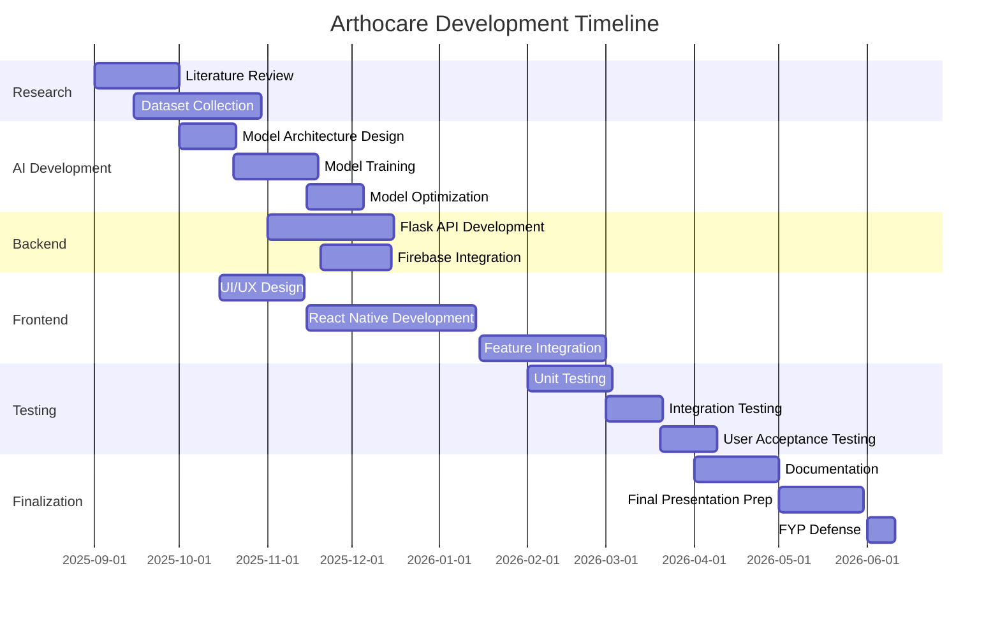

<div align="center">

# 🦴 Arthocare
### AI-Driven Medical Application for Arthritis Management

[](https://github.com/HEERHARISH1/arthocare)
[](https://github.com/HEERHARISH1/arthocare)
[](LICENSE)
[](https://github.com/HEERHARISH1/arthocare)
[](https://isb.nu.edu.pk/)

*Empowering arthritis patients with AI-powered self-monitoring, early detection, and personalized care — right from their smartphone.*

</div>

---

## 📋 Table of Contents

- [About](#-about)
- [Problem Statement](#-problem-statement)
- [Features](#-features)
- [Tech Stack](#-tech-stack)
- [Architecture](#-architecture)
- [Installation](#-installation)
- [Team](#-team)
- [Project Supervision](#-project-supervision)
- [Project Timeline](#-project-timeline)
- [Current Status](#-current-status)
- [Future Enhancements](#-future-enhancements)
- [Known Issues](#-known-issues)
- [Contributing](#-contributing)
- [License](#-license)
- [Acknowledgments](#-acknowledgments)
- [Contact](#-contact--support)

---

## 🏥 About

**Arthocare** is an AI-powered mobile application (Android/iOS) designed to provide end-to-end clinical support for arthritis patients. It leverages computer vision and machine learning to analyze joint images, detect inflammation levels, track symptom progression, deliver personalized exercise recommendations, and manage medication reminders — all from a smartphone.

This is a **Final Year Project (FYP)** developed at FAST-NUCES, Islamabad (September 2025 – June 2026).

---

## ❓ Problem Statement

Arthritis patients face significant challenges in:
- **Early detection** — lack of accessible diagnostic tools outside clinics
- **Severity monitoring** — no easy way to track disease progression at home
- **Daily management** — difficulty maintaining exercise routines and medication schedules
- **Doctor communication** — limited structured data sharing with healthcare providers

Existing solutions lack AI-driven personalized care and real-time symptom tracking via mobile platforms, especially for underserved communities.

---

## ✨ Features

### 🤖 AI-Powered Joint Analysis
- Computer vision model trained on medical imaging datasets
- Real-time inflammation detection from smartphone camera
- Severity classification: **Mild · Moderate · Severe**
- TensorFlow Lite integration for on-device (edge) inference

### 📊 Symptom Tracking Dashboard
- Daily pain level monitoring
- Movement range tracking
- Visual analytics and trend graphs
- Data export for sharing with doctors

### 💊 Personalized Care Recommendations
- ML-based exercise suggestions tailored to severity level
- Medication reminders with dosage tracking
- Diet recommendations based on user profile

### 🩺 Doctor-Patient Communication
- Secure data sharing with healthcare providers
- Appointment scheduling and reminders
- Progress report generation

---

## 🛠️ Tech Stack

| Layer | Technology |
|---|---|
| **Mobile Frontend** | React Native |
| **ML Model** | TensorFlow, TensorFlow Lite, MobileNetV2 (Transfer Learning) |
| **Computer Vision** | OpenCV, CNN for joint image classification |
| **Backend API** | Flask (Python) |
| **Database** | Firebase (cloud), SQLite (local) |
| **Authentication** | Firebase Auth |
| **Deployment** | On-device inference (TensorFlow Lite) |
| **Other Tools** | Android Studio, Python, Kotlin |

---

## 🏗️ Architecture

```
┌─────────────────────────────────────────────┐
│              Mobile App (React Native)       │
│  ┌──────────┐  ┌──────────┐  ┌───────────┐  │
│  │ Joint    │  │Symptom   │  │Medication │  │
│  │ Scanner  │  │Tracker   │  │Reminders  │  │
│  └────┬─────┘  └────┬─────┘  └─────┬─────┘  │
└───────┼─────────────┼──────────────┼─────────┘
        │             │              │
        ▼             ▼              ▼
┌───────────────────────────────────────────┐
│           Flask REST API (Backend)         │
│  ┌──────────────┐    ┌───────────────────┐ │
│  │ CV Pipeline  │    │  Firebase (Auth + │ │
│  │ (OpenCV +    │    │  Cloud Storage)   │ │
│  │  TFLite)     │    └───────────────────┘ │
│  └──────────────┘                          │
└───────────────────────────────────────────┘
        │
        ▼
┌───────────────────────────────────────────┐
│         ML Model (TensorFlow Lite)         │
│  CNN + MobileNetV2 — 85%+ Accuracy         │
│  Severity: Mild | Moderate | Severe        │
└───────────────────────────────────────────┘
```

---

## ⚙️ Installation

### Prerequisites
- Node.js >= 16
- Python >= 3.9
- Android Studio / Xcode
- Firebase account
- React Native CLI

### Clone the Repository
```bash
git clone https://github.com/HEERHARISH1/arthocare.git
cd arthocare
```

### Backend Setup (Flask API)
```bash
cd backend
pip install -r requirements.txt
python app.py
```

### Mobile App Setup (React Native)
```bash
cd mobile
npm install
npx react-native run-android   # For Android
npx react-native run-ios       # For iOS
```

### Environment Variables
Create a `.env` file in `/backend`:
```
FIREBASE_API_KEY=your_key
FIREBASE_PROJECT_ID=your_project_id
MODEL_PATH=./models/arthocare_model.tflite
```

---

## 👥 Team

Meet the amazing team behind Arthocare:

<table>
  <tr>
    <td align="center">
      <a href="https://github.com/HEERHARISH1">
        
        <br />
        <sub><b>Heer Lohana</b></sub>
      </a>
      <br />
      <a href="https://linkedin.com/in/heerharish">LinkedIn</a> •
      <a href="https://github.com/HEERHARISH1">GitHub</a> •
      <a href="mailto:heer.harish04@gmail.com">Email</a>
      <br />
      <sub>AI/ML Engineer • Backend Developer</sub>
      <br />
      <sub>📞 +92 303 9049119</sub>
    </td>
    <td align="center">
      <a href="https://www.linkedin.com/in/umema-ashar-2004ua">
        
        <br />
        <sub><b>Umema Ashar</b></sub>
      </a>
      <br />
      <a href="https://www.linkedin.com/in/umema-ashar-2004ua">LinkedIn</a> •
      <a href="mailto:umema2004@gmail.com">Email</a>
      <br />
      <sub>Frontend Developer • UI/UX Designer</sub>
      <br />
      <sub>📞 +92 300 8420208</sub>
    </td>
    <td align="center">
      <a href="https://www.linkedin.com/in/hamza-asad-6bb307253/">
        
        <br />
        <sub><b>Hamza Asad</b></sub>
      </a>
      <br />
      <a href="https://www.linkedin.com/in/hamza-asad-6bb307253/">LinkedIn</a> •
      <a href="mailto:hamza26asad@gmail.com">Email</a>
      <br />
      <sub>Full-Stack Developer • Database Engineer</sub>
      <br />
      <sub>📞 +92 333 4365190</sub>
    </td>
  </tr>
</table>

### Roles & Contributions

#### 🤖 Heer Lohana
- AI/ML model development and training (CNN + MobileNetV2, 85%+ accuracy)
- Backend API architecture (Flask)
- Computer vision pipeline (OpenCV)
- Model optimization and TensorFlow Lite deployment
- Research, dataset preparation, and project leadership

#### 🎨 Umema Ashar
- Mobile app UI/UX design
- React Native frontend development
- User experience optimization
- Health tracking features
- App testing and quality assurance

#### 💻 Hamza Asad
- Firebase integration and setup
- Database schema design
- API integration with frontend
- Medication management module
- Push notifications system

---

## 🎓 Project Supervision

**Supervisor:** Dr. Muhammad Faisal Cheema
**Title:** Assistant Professor & Director, KDD Research Lab
**Department:** Computer Science
**Institution:** FAST-NUCES, Islamabad

---

## 📅 Project Timeline



---

## 📈 Current Status (May 2026)

- ✅ ML model trained and validated — **85%+ accuracy** on validation set
- ✅ Core mobile app features implemented and tested
- ✅ User interface design completed
- ✅ Firebase backend integrated
- 🔄 Beta testing with medical professionals — in progress
- 🔄 Final documentation — in progress
- 📅 FYP Defense — June 2026

---

## 🎯 Future Enhancements

### Phase 2 (Post-Graduation)
- [ ] Multi-disease support (Osteoporosis, Rheumatoid Arthritis variants)
- [ ] Doctor consultation booking integration
- [ ] Telemedicine video call feature
- [ ] Lab test result integration
- [ ] Insurance claim assistance

### Phase 3 (Long-term Vision)
- [ ] AI chatbot for health queries
- [ ] Wearable device integration (smartwatch data)
- [ ] Community forum for patients
- [ ] Research data contribution (anonymized)
- [ ] Multi-language support (10+ languages)

---

## 🐛 Known Issues

- [ ] Image upload fails on slow internet connections (working on compression)
- [ ] iOS push notifications need additional testing
- [ ] Exercise videos buffer on 3G connections
- [ ] Dark mode UI needs refinement

See [Issues](https://github.com/HEERHARISH1/arthocare/issues) for a complete list.

---

## 🤝 Contributing

We welcome contributions from the community! However, as this is an academic project, please:

1. Contact the team before making significant changes
2. Follow the existing code style and conventions
3. Write tests for new features
4. Update documentation accordingly

### How to Contribute

1. Fork the repository
2. Create your feature branch (`git checkout -b feature/AmazingFeature`)
3. Commit your changes (`git commit -m 'Add some AmazingFeature'`)
4. Push to the branch (`git push origin feature/AmazingFeature`)
5. Open a Pull Request

---

## 📄 License

This project is licensed under the MIT License — see the [LICENSE](LICENSE) file for details.

---

## 🙏 Acknowledgments

We would like to express our gratitude to:

- **FAST-NUCES** for providing the platform and resources
- **Dr. Muhammad Faisal Cheema** for guidance and mentorship throughout the project
- **KDD Research Lab** for research support and facilities
- **Healthcare Professionals** who provided domain expertise
- **Dataset Providers** (Kaggle, UCI ML Repository) for training data
- **Open Source Community** for amazing tools and libraries

### Special Thanks To
- **TensorFlow Team** for the ML framework
- **React Native Community** for mobile development tools
- **Firebase Team** for backend services
- **Stack Overflow Community** for problem-solving support

---

## 📞 Contact & Support

### Team

| Name |  Email | LinkedIn | Phone |
|---|---|---|---|
| Heer Lohana  | heer.harish04@gmail.com | [LinkedIn](https://linkedin.com/in/heerharish) | +92 303 9049119 |
| Umema Ashar =| umema2004@gmail.com | [LinkedIn](https://www.linkedin.com/in/umema-ashar-2004ua) | +92 300 8420208 |
| Hamza Asad  | hamza26asad@gmail.com | [LinkedIn](https://www.linkedin.com/in/hamza-asad-6bb307253/) | +92 333 4365190 |


---

<div align="center">
<sub>© 2026 Arthocare Team | FAST-NUCES Islamabad | Final Year Project</sub>
</div>
